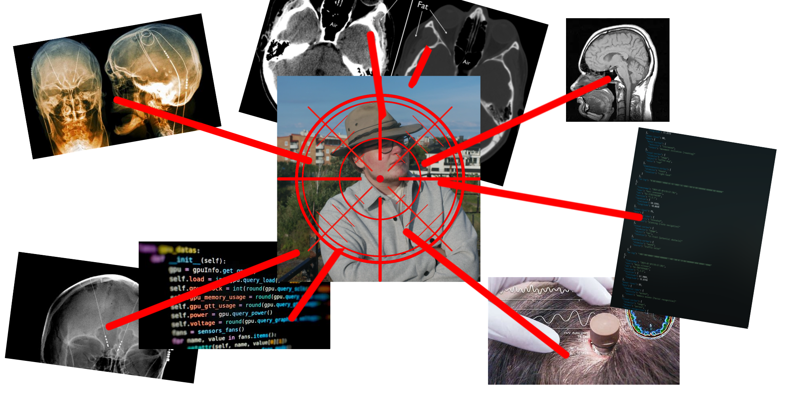

# MyrCTF 2024

---
MyrCTF is a CTF created and hosted by [@arch-err](https://github.com/arch-err), [@jabb4](https://github.com/jabb4), and [@eightheart](https://app.hackthebox.com/profile/1052332)

## Contributors
Aside from the core team listed above, some challenges were created by the community.

We (the core team) want to pay special thanks to:
- [@Tok1](https://github.com/tokfrans03)
- `<redacted>`
- @Joar
- @challe

## Info

We created 39 challenges for this CTF, but since not all of them were solved, we will only make the solved ones public (we may want to reuse some challenges for next year :P)

Below are all of the challenges that made it into the CTF, but there will only be links for the solved ones.
In these subfolders you'll find a `challenge.yaml` that includes some metadata about the challenge.
There may be a "writeup" in the form of a `solve.md`, but if you want a better writeup, please contact [@arch-err](https://github.com/arch-err) on discord.
We have tried to make most of the challenges accessible/playable from the contents of this repo, but there may not be a simple generate-script or guide for every challenge. If you want more info about a challenge, please contact [@arch-err](https://github.com/arch-err) on discord.

## Challenges

### Scripting
- [Zippy 1](./Challenges/Zippy_1/) made by [@arch-err](https://github.com/arch-err)
- [Zippy 2](./Challenges/Zippy_2/) made by [@arch-err](https://github.com/arch-err)
- [Base 1](./Challenges/Base_1/) made by [@jabb4](https://github.com/jabb4)
- [Base 2](./Challenges/Base_2/) made by [@jabb4](https://github.com/jabb4)
- [FMJobb](./Challenges/FMJobb/) made by [@Tok1](https://github.com/tokfrans03)

### Pain
- Reverse-Shell made by [@arch-err](https://github.com/arch-err)
- Pling Plong Pling Plong made by `<redacted>`
- [WeirdTicTacToe](./Challenges/WeirdTicTacToe) made by **Joar**

### Web
- [Impossible-Blog](./Challenges/Impossible-Blog/) made by [@eightheart](https://app.hackthebox.com/profile/1052332)
- [Verborgen](./Challenges/Verborgen/) made by [@arch-err](https://github.com/arch-err)
- [Zeit](./Challenges/Zeit/) made by [@arch-err](https://github.com/arch-err)
- [Tekanna](./Challenges/Tekanna/) made by [@arch-err](https://github.com/arch-err)
- [Possible-Blog](./Challenges/Possible-Blog/) made by [@eightheart](https://app.hackthebox.com/profile/1052332)
- [F***ing SSO](./Challenges/F---ing_SSO/) made by [@arch-err](https://github.com/arch-err)

## Misc
- [Gunnars Pipande Problem](./Challenges/Gunnars Pipande Problem/) made by [@eightheart](https://app.hackthebox.com/profile/1052332)
- [Hemligheter](./Challenges/Hemligheter/) made by [@arch-err](https://github.com/arch-err)
- ICU made by `<redacted>`
- Kaninhal made by [@arch-err](https://github.com/arch-err)

### Pwn
- [DIY-NTP](./Challenges/DIY-NTP/) made by [@eightheart](https://app.hackthebox.com/profile/1052332)
- [FunktionelltKul](./Challenges/FunktionelltKul/) made by [@eightheart](https://app.hackthebox.com/profile/1052332)

### Stolen Research
- flag game made by `<redacted>`
- Where was that again? made by `<redacted>`
- Löken made by `<redacted>`
- Desert Yam QR made by `<redacted>`

### Forensics
- [Docker 1](./Challenges/Docker_1/) made by [@Tok1](https://github.com/tokfrans03)
- [Fisk](./Challenges/Fisk/) made by [@arch-err](https://github.com/arch-err)
- [SUS USB](./Challenges/SUS_USB/) made by [@jabb4](https://github.com/jabb4)
- [Docker 2](./Challenges/Docker_2/) made by [@Tok1](https://github.com/tokfrans03)
- Vi glömde avkodarn...  made by `<redacted>`

### Cryptography
- [RoteraMera](./Challenges/RoteraMera/) made by [@arch-err](https://github.com/arch-err)
- [CyberKock](./Challenges/CyberKock/) made by [@arch-err](https://github.com/arch-err)
- Gamla Hemlisar made by [@arch-err](https://github.com/arch-err)

### Reverse Engineering
- [Unknown exe](./Challenges/Unknown_exe/) made by [@jabb4](https://github.com/jabb4)
- [NeuralNexus](./Challenges/NeuralNexus/) made by **challe**

### OSINT
- [FöretagsExpedition](./Challenges/FöretagsExpedition/) made by [@eightheart](https://app.hackthebox.com/profile/1052332)
- ÄrViLive made by [@eightheart](https://app.hackthebox.com/profile/1052332)

# Contact
If you want more info or a writeup of a certain challenge, please contact [@arch-err](https://github.com/arch-err) on discord.
